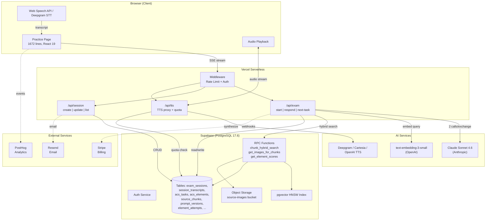
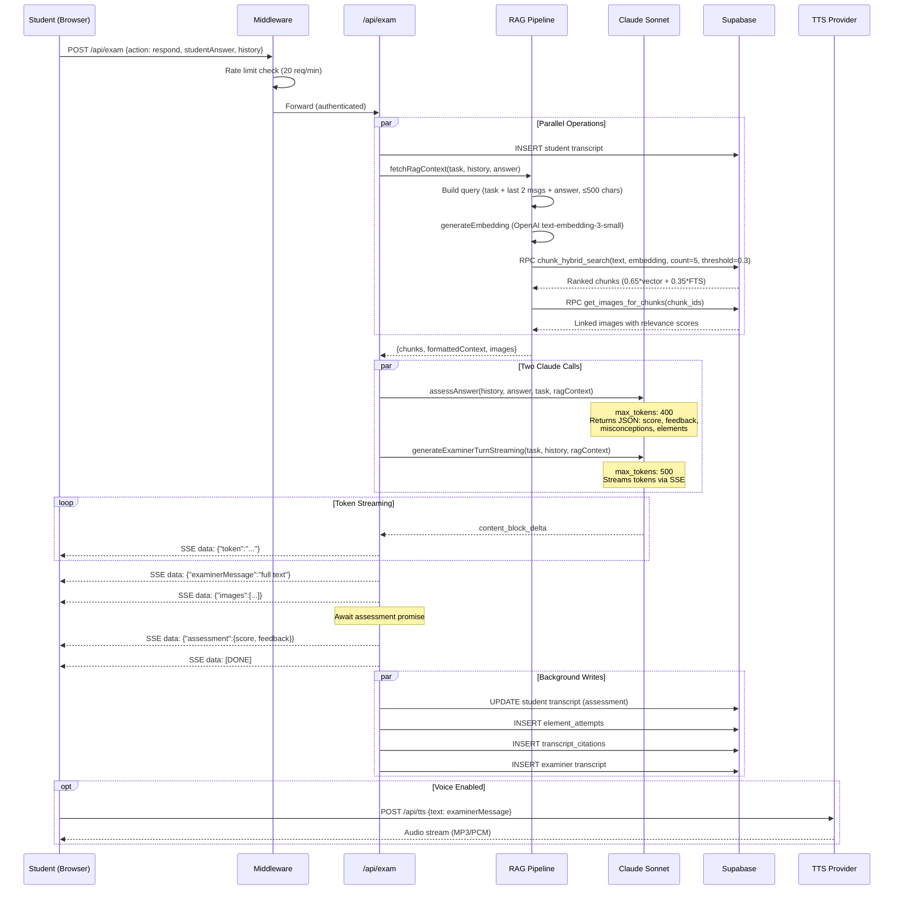

# Tech Stack Inventory

> [!info] Evidence Base
> All versions from `package.json`. All config details from actual config files. No assumptions.

---

## Dependency Map

| Component | Package | Version | Responsibility | Data Stores | Network Calls |
|-----------|---------|---------|----------------|-------------|---------------|
| **Framework** | `next` | 16.1.6 (pinned) | App Router, SSR, API routes, middleware | — | Vercel serverless |
| **React** | `react` / `react-dom` | 19.2.3 (pinned) | UI rendering | — | — |
| **TypeScript** | `typescript` | ^5 | Type safety | — | — |
| **Styling** | `tailwindcss` + `@tailwindcss/postcss` | ^4 | Dark theme, responsive | — | — |
| **AI Examiner** | `@anthropic-ai/sdk` | ^0.74.0 | DPE persona, answer assessment | — | Anthropic API |
| **AI SDK** | `ai` (Vercel AI SDK) | ^6.0.86 | Streaming utilities | — | — |
| **Embeddings** | `openai` | ^6.22.0 | text-embedding-3-small (1536d) | — | OpenAI API |
| **TTS (Primary)** | `@deepgram/sdk` | ^4.11.3 | Text-to-speech synthesis | — | Deepgram API |
| **TTS (Fallback)** | `@cartesia/cartesia-js` | ^2.2.9 | High-quality TTS (Cartesia) | — | Cartesia API |
| **Database** | `@supabase/supabase-js` + `@supabase/ssr` | ^2.95.3 / ^0.8.0 | PostgreSQL + pgvector + Auth + Storage | Supabase (PG 17.6) | Supabase REST/Realtime |
| **Payments** | `stripe` | ^20.3.1 | Subscription billing | — | Stripe API |
| **Webhooks** | `svix` | ^1.85.0 | Webhook verification | — | — |
| **Email** | `resend` + `@react-email/components` | ^6.9.2 / ^1.0.8 | Transactional email | — | Resend API |
| **Analytics** | `posthog-js` | ^1.351.1 | Product analytics, feature flags | — | PostHog API |
| **PDF Parsing** | `pdf-parse` | ^1.1.1 | Ingestion pipeline (server scripts) | — | — |
| **Charts** | `@nivo/core` + `@nivo/treemap` | ^0.99.0 | Progress page visualizations | — | — |
| **Google** | `@next/third-parties` | ^16.1.6 | Google Analytics integration | — | Google |
| **Testing** | `vitest` | ^4.0.18 | Unit tests (77 tests) | — | — |
| **E2E Testing** | `@playwright/test` | ^1.58.2 | Browser automation tests | — | localhost |
| **Script Runner** | `tsx` | ^4.21.0 | TypeScript script execution | — | — |

---

## Infrastructure

| Layer | Technology | Config Location | Notes |
|-------|-----------|-----------------|-------|
| **Hosting** | Vercel (serverless) | `.vercel/project.json` | Auto-deploy from `main`, project ID `prj_HISCL3Q...` |
| **Database** | Supabase PostgreSQL 17.6 | `supabase/migrations/` (35 files) | pgvector, RLS, RPC functions, East US region |
| **Object Storage** | Supabase Storage | `source-images` bucket | FAA diagram/chart images |
| **Auth** | Supabase Auth | Email/password + confirmation flow | Session refresh in middleware |
| **CI/CD** | GitHub Actions | `.github/workflows/ci.yml` | Lint + typecheck + test on PR and push to main |
| **Containerization** | None | — | Pure serverless |
| **Caching** | Module-level TTL caches + DB embedding cache | `src/lib/ttl-cache.ts` | system_config (60s), prompts (5min), tier/voice (5min), embedding_cache table |
| **Observability** | PostHog + `usage_logs` + `latency_logs` + timing spans | `src/lib/timing.ts` | Per-exchange JSONB spans: prechecks, rag, assessment, examiner |
| **Rate Limiting** | In-memory sliding window | `src/lib/rate-limit.ts` | Resets on cold starts; not billing-safe |

---

## Build & Development

| Tool | Config File | Notes |
|------|-------------|-------|
| TypeScript | `tsconfig.json` | `strict: true`, `moduleResolution: "bundler"`, `@/` → `./src/` |
| Tailwind CSS v4 | `postcss.config.mjs` | No `tailwind.config` — Tailwind v4 uses CSS directives |
| ESLint v9 | `eslint.config.mjs` | Flat config, Next.js Core Web Vitals + TypeScript rules |
| Vitest | `vitest.config.ts` | Node environment, `@/` alias, e2e excluded |
| Playwright | `playwright.config.ts` | 5 projects (setup, chromium, firefox, webkit, admin, no-auth) |
| Next.js | `next.config.ts` | Security headers only (X-Frame-Options: DENY, microphone: self) |

---

## Python Tooling (Ingestion Scripts)

| Package | Version | Purpose | Location |
|---------|---------|---------|----------|
| PyMuPDF (fitz) | >=1.24.0 | PDF image extraction | `scripts/extract-images/` |
| Pillow | >=10.0.0 | Image processing/optimization | `scripts/extract-images/` |
| supabase-py | >=2.0.0 | DB writes from Python | `scripts/extract-images/` |
| python-dotenv | >=1.0.0 | Env loading | `scripts/extract-images/` |
| pytest | >=8.0.0 | Python tests | `scripts/extract-images/tests/` |

---

## Source Corpus (FAA Materials)

| Directory | Contents | Count |
|-----------|----------|-------|
| `sources/phak/` | Pilot's Handbook of Aeronautical Knowledge chapters | 20 PDFs |
| `sources/afh/` | Airplane Flying Handbook chapters | 20 PDFs |
| `sources/aim/` | Aeronautical Information Manual + chapters | 1 + subdir |
| `sources/cfr/` | Code of Federal Regulations (Parts 39,43,61,68,71,73,91,93,97) | 9 PDFs |
| `sources/ac/` | Advisory Circulars | 11 PDFs |
| `sources/acs/` | Airman Certification Standards (6C, 7B, 8C) | 3 PDFs |
| `sources/handbooks/` | IFH, AWH, RMH, WBH, IPH, Seaplane (chapters) | 6 subdirs |
| `sources/other/` | Chart Users Guide, Testing Supplement, Nav Rules, etc. | 6 PDFs |

---

## High-Level Architecture Diagram

---

## Data Flow: Single Student Exchange

---

## Key Observations

> [!risk] CLAUDE.md is Stale
> The CLAUDE.md describes a much simpler system (no Stripe, no Deepgram/Cartesia, no Resend, no PostHog, no image pipeline, simpler DB schema). The actual system has grown significantly beyond what's documented.

> [!risk] No Caching Layer
> Zero caching anywhere — embeddings, search results, prompts, and system config are all fetched fresh per request. This is by design for serverless but adds latency.

> [!risk] No CI/CD Pipeline
> No automated tests run on push. No build validation before deploy. Vercel auto-deploys from `main` directly.

> [!risk] No APM/Tracing
> No distributed tracing (no OpenTelemetry, Datadog, etc.). `latency_logs` table exists but is not populated. Performance issues are invisible.

---

*See also: [[02 - Current Architecture Map]], [[05 - Latency Audit and Instrumentation Plan]]*
