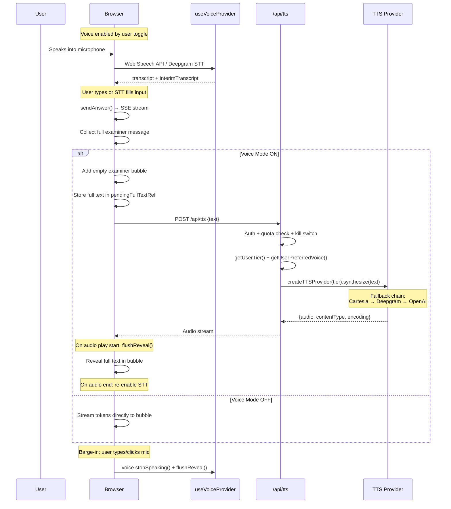

# Current Architecture Map

---

## System Architecture Overview

HeyDPE is a **Next.js 16 App Router** application deployed on **Vercel** (serverless) with **Supabase** (PostgreSQL 17.6 + pgvector + Auth + Storage) as the sole persistence layer. There is no separate backend service, queue, or cache.

### Runtime Components

| Component | Location | Purpose |
|-----------|----------|---------|
| Root Middleware | `src/middleware.ts` | Rate limiting (in-memory) + auth session refresh |
| Supabase Middleware | `src/lib/supabase/middleware.ts` | Session refresh, route protection, account status enforcement |
| Exam API | `src/app/api/exam/route.ts` | Core exam engine (start, respond, next-task, resume-current) |
| Session API | `src/app/api/session/route.ts` | Session CRUD, trial limits, grading |
| TTS API | `src/app/api/tts/route.ts` | TTS proxy with quota and kill-switch |
| Exam Engine | `src/lib/exam-engine.ts` | Anthropic + RAG integration, streaming, assessment |
| Exam Logic | `src/lib/exam-logic.ts` | Pure functions: filtering, selection, prompts, grading |
| Exam Planner | `src/lib/exam-planner.ts` | Element-level planner: init, advance, task lookup |
| RAG Retrieval | `src/lib/rag-retrieval.ts` | OpenAI embeddings + Supabase hybrid search |
| Prompt System | `src/lib/prompts.ts` | Safety prefix + fallback prompts + DB prompt loading |
| Voice Providers | `src/lib/voice/` | TTS provider factory + tier lookup + usage/quota |
| Practice Page | `src/app/(dashboard)/practice/page.tsx` | 1672-line client component: UI + state + streaming |

---

## Major Runtime Flows

### Flow 1: Authentication & Session Management

```mermaid
flowchart TD
    A[User visits /login] --> B[Submit email + password]
    B --> C[Supabase Auth signInWithPassword]
    C --> D{Success?}
    D -->|Yes| E[Redirect to /practice]
    D -->|No| F[Show error]

    G[User visits /signup] --> H[Submit email + password]
    H --> I[Supabase Auth signUp]
    I --> J[Confirmation email sent via Resend]
    J --> K[User clicks email link]
    K --> L[/auth/callback?code=...]
    L --> M[Exchange code for session]
    M --> E

    subgraph Middleware["Every Request"]
        MW1[Rate limit check] --> MW2[Supabase session refresh]
        MW2 --> MW3{Account status?}
        MW3 -->|banned| MW4[Force sign out]
        MW3 -->|suspended| MW5[Redirect to /suspended]
        MW3 -->|active| MW6[Continue]
    end
```

**Evidence:**
- Auth callback: `src/app/auth/callback/route.ts`
- Middleware: `src/middleware.ts:5-77`, `src/lib/supabase/middleware.ts`
- Account status enforcement: `src/lib/supabase/middleware.ts` (banned/suspended checks)

### Flow 2: Exam Session Lifecycle

```mermaid
stateDiagram-v2
    [*] --> ConfigureExam: User selects rating + options
    ConfigureExam --> CreateSession: POST /api/session {action: create}

    state CreateSession {
        [*] --> CheckTrial: Free tier?
        CheckTrial --> TrialLimit: count >= 3
        TrialLimit --> [*]: 403 trial_limit_reached
        CheckTrial --> InsertSession: allowed
        InsertSession --> [*]: session created
    }

    CreateSession --> StartExam: POST /api/exam {action: start}

    state StartExam {
        [*] --> KillSwitch: checkKillSwitch()
        KillSwitch --> Blocked: 503 maintenance
        KillSwitch --> EnforceOneExam: enforceOneActiveExam()
        EnforceOneExam --> PauseOthers: pause other devices
        PauseOthers --> InitPlanner: initPlanner(config)
        InitPlanner --> FirstQuestion: generateExaminerTurn()
        FirstQuestion --> [*]: examiner opening
    }

    StartExam --> ExamLoop: Active exam

    state ExamLoop {
        [*] --> StudentAnswers: User submits answer
        StudentAnswers --> ParallelOps: persist + RAG
        ParallelOps --> TwoClaude: assess + examiner
        TwoClaude --> StreamResponse: SSE tokens
        StreamResponse --> [*]: exchange complete
    }

    ExamLoop --> NextTask: POST /api/exam {action: next-task}
    NextTask --> ExamLoop: more elements

    ExamLoop --> UserEnds: User clicks End Exam
    NextTask --> AutoComplete: all elements exhausted

    UserEnds --> ComputeGrade: computeExamResult()
    AutoComplete --> ComputeGrade

    ComputeGrade --> Completed: status: completed + result
    Completed --> [*]
```



**Evidence:**
- Session creation + trial limits: `src/app/api/session/route.ts:26-84`
- Kill switch: `src/lib/kill-switch.ts`
- Session enforcement: `src/lib/session-enforcement.ts`
- Planner init: `src/lib/exam-planner.ts:31-95`
- Exchange loop: `src/app/api/exam/route.ts:343-517`
- Auto-complete: `src/app/api/exam/route.ts:577-609`
- Grading: `src/lib/exam-logic.ts:344-388`

### Flow 3: Voice Pipeline



**Evidence:**
- Voice hook usage: `src/app/(dashboard)/practice/page.tsx:139-399`
- TTS API: `src/app/api/tts/route.ts`
- Provider factory: `src/lib/voice/provider-factory.ts`
- Sentence boundary: `src/lib/voice/sentence-boundary.ts` (aviation-aware)
- Tier features: `src/lib/voice/types.ts` (all 3 tiers currently map to Deepgram)

#### Voice Provider Priority Order (as of 2026-02-19)

> [!important] All 3 tiers currently use Deepgram as the primary TTS provider.
> Despite the fallback chain supporting Cartesia → Deepgram → OpenAI, the `TIER_FEATURES` mapping in `types.ts` assigns `ttsProvider: 'deepgram'` for all tiers (`ground_school`, `checkride_prep`, `dpe_live`).

| Tier | Primary TTS | STT | Fallback Chain |
|------|------------|-----|---------------|
| `ground_school` | Deepgram (`aura-2-orion-en`) | Deepgram | → OpenAI |
| `checkride_prep` | Deepgram (`aura-2-orion-en`) | Deepgram | → OpenAI |
| `dpe_live` | Deepgram (`aura-2-orion-en`) | Deepgram | → OpenAI |

**Fallback logic** (`src/lib/voice/provider-factory.ts`):
- `createTTSProvider(tier)` reads `TIER_FEATURES[tier].ttsProvider` to determine the primary
- If primary constructor throws, `getFallbackChain()` returns: `cartesia → [deepgram, openai]`, `deepgram → [openai]`, `openai → []`
- Since all tiers map to `deepgram`, the effective runtime chain is **Deepgram → OpenAI**
- Cartesia is never the primary; it exists in the fallback chain only if someone manually sets a tier's `ttsProvider` to `'cartesia'`

**CLAUDE.md discrepancy:** The original CLAUDE.md states "TTS: OpenAI TTS (tts-1, voice: onyx)" — this is outdated. The code was refactored to use Deepgram as the universal provider. OpenAI serves as the last-resort fallback only.

---

## Database Schema (35 Migrations)

### Core Tables

| Table | Purpose | Key Columns | RLS |
|-------|---------|-------------|-----|
| `acs_tasks` | 143 ACS task definitions (PA:61, CA:60, IR:22) | `id`, `area`, `task`, `rating`, `knowledge_elements[]`, `risk_management_elements[]` | Read-only authenticated |
| `acs_elements` | Normalized elements (one row per K/R/S element) | `code`, `task_id`, `element_type`, `description`, `difficulty_default`, `weight` | Read authenticated |
| `exam_sessions` | User exam sessions | `user_id`, `rating`, `status`, `metadata` (JSONB: plannerState, sessionConfig), `result`, `expires_at` | User owns own |
| `session_transcripts` | Full Q&A transcripts | `session_id`, `role`, `text`, `exchange_number`, `assessment_score`, `assessment_feedback` | Via session ownership |
| `element_attempts` | Per-element scoring history | `session_id`, `user_id`, `element_code`, `task_id`, `score`, `tag_type` | Via session |
| `source_documents` | Registered FAA PDFs | `file_name`, `title`, `abbreviation`, `doc_type`, `edition_date` | Read authenticated |
| `source_chunks` | Text chunks with embeddings | `document_id`, `content`, `embedding` (vector 1536), `heading`, `page_start/end`, `content_hash` | Read authenticated |
| `source_images` | Extracted images | `document_id`, `figure_label`, `caption`, `storage_path`, `page_number` | Read authenticated |
| `chunk_image_links` | Chunk ↔ image associations | `chunk_id`, `image_id`, `link_type`, `relevance_score` | Read authenticated |
| `user_profiles` | User preferences + billing | `tier`, `preferred_voice`, `theme`, `stripe_customer_id`, `onboarding_completed` | User owns own |
| `prompt_versions` | Versioned system prompts | `prompt_key`, `content`, `version`, `status`, `rating`, `study_mode`, `difficulty` | Read authenticated |
| `system_config` | Feature flags + kill switches | `key`, `value` (JSONB) | Admin only |
| `active_sessions` | Device tracking for one-exam enforcement | `user_id`, `session_token_hash`, `exam_session_id`, `is_exam_active` | Service role |
| `usage_logs` | TTS/LLM usage events | `user_id`, `event_type`, `metadata` | Insert own |
| `concepts` | Knowledge graph nodes (EMPTY) | `name`, `category`, `embedding`, `key_facts`, `validation_status` | Read validated |
| `concept_relations` | Knowledge graph edges (EMPTY) | `source_concept_id`, `target_concept_id`, `relation_type`, `weight` | Read all |

### RPC Functions

| Function | Purpose | Used By |
|----------|---------|---------|
| `chunk_hybrid_search` | 0.65 * vector_sim + 0.35 * FTS_rank | `rag-retrieval.ts` |
| `get_images_for_chunks` | Images linked to chunks with relevance | `rag-retrieval.ts` |
| `get_element_scores` | Lifetime per-element performance | `exam-planner.ts` (weak_areas mode) |
| `get_session_element_scores` | Per-session element performance | `session/route.ts` (grading) |
| `hybrid_search` | Vector + FTS on concepts table | **Not used** (concepts empty) |
| `get_related_concepts` | Recursive CTE graph traversal depth 3 | **Not used** (concepts empty) |
| `get_uncovered_acs_tasks` | Tasks not yet covered in session | **Not used** (legacy) |

---

## Evidence Pointers (File Index)

| Module | Key Files | Key Functions (with line ranges) |
|--------|-----------|--------------------------------|
| Exam API | `src/app/api/exam/route.ts` | `POST handler:240-341` (start), `:343-517` (respond), `:552-689` (next-task) |
| Assessment | `src/lib/exam-engine.ts` | `assessAnswer:367-510`, `loadPromptFromDB:62-96` |
| Examiner Gen | `src/lib/exam-engine.ts` | `generateExaminerTurn:187-255`, `generateExaminerTurnStreaming:257-358` |
| RAG | `src/lib/rag-retrieval.ts` | `searchChunks:39-78`, `generateEmbedding:27-37`, `getImagesForChunks:120-145` |
| Planner | `src/lib/exam-planner.ts` | `initPlanner:31-95`, `advancePlanner:97-148` |
| Pure Logic | `src/lib/exam-logic.ts` | `buildElementQueue:212-270`, `pickNextElement:275-316`, `buildSystemPrompt:126-199`, `computeExamResult:344-388` |
| Prompts | `src/lib/prompts.ts` | `IMMUTABLE_SAFETY_PREFIX:1-6`, `getPromptContent:22-36` |
| Rate Limiting | `src/lib/rate-limit.ts` | `checkRateLimit` (sliding window, 7 route configs) |
| Kill Switch | `src/lib/kill-switch.ts` | `checkKillSwitch` (maintenance + provider + tier) |
| Session Enforcement | `src/lib/session-enforcement.ts` | `enforceOneActiveExam:44-124` |
| Voice | `src/lib/voice/provider-factory.ts` | `createTTSProvider` (Cartesia → Deepgram → OpenAI fallback) |
| Practice UI | `src/app/(dashboard)/practice/page.tsx` | `startSession:401`, `sendAnswer:523`, voice integration: `139-399` |

---

> [!decision] Architecture Principle: Pure/Impure Split
> The codebase cleanly separates pure functions (`exam-logic.ts`, `kill-switch.ts`, `prompts.ts`) from impure integration code (`exam-engine.ts`, `exam-planner.ts`, `rag-retrieval.ts`). This enables unit testing of all core logic without mocking external services.

> [!risk] Empty Knowledge Graph
> `concepts` and `concept_relations` tables + their RPC functions (`hybrid_search`, `get_related_concepts`) exist but contain zero rows. The system currently operates entirely on chunk-level RAG. This represents significant untapped capability.

> [!risk] Monolithic Practice Page
> `practice/page.tsx` at 1672 lines is a single client component managing exam state, voice integration, streaming, session config, onboarding, error recovery, and reporting. This is the highest-risk file for regressions.

---

*See also: [[01 - Tech Stack Inventory]], [[03 - Knowledge Base and Retrieval Pipeline]], [[04 - Exam Flow Engine]]*
