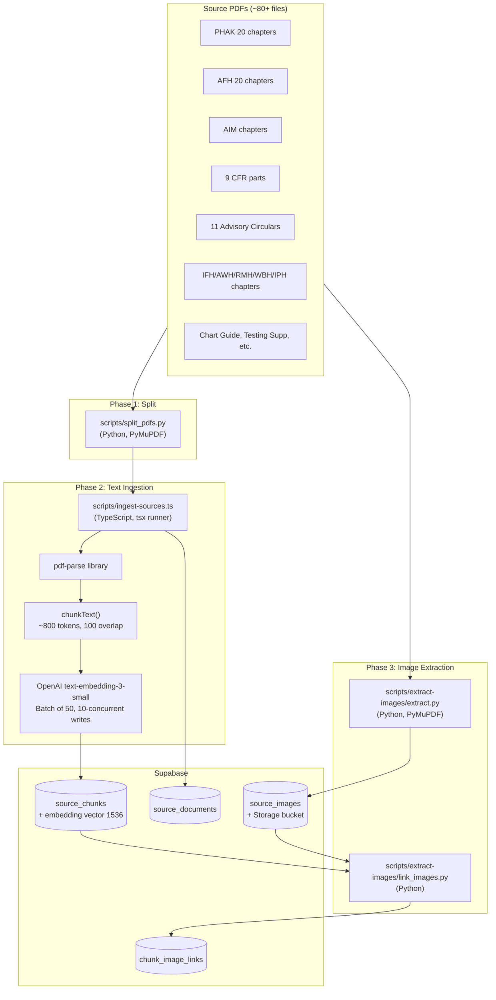
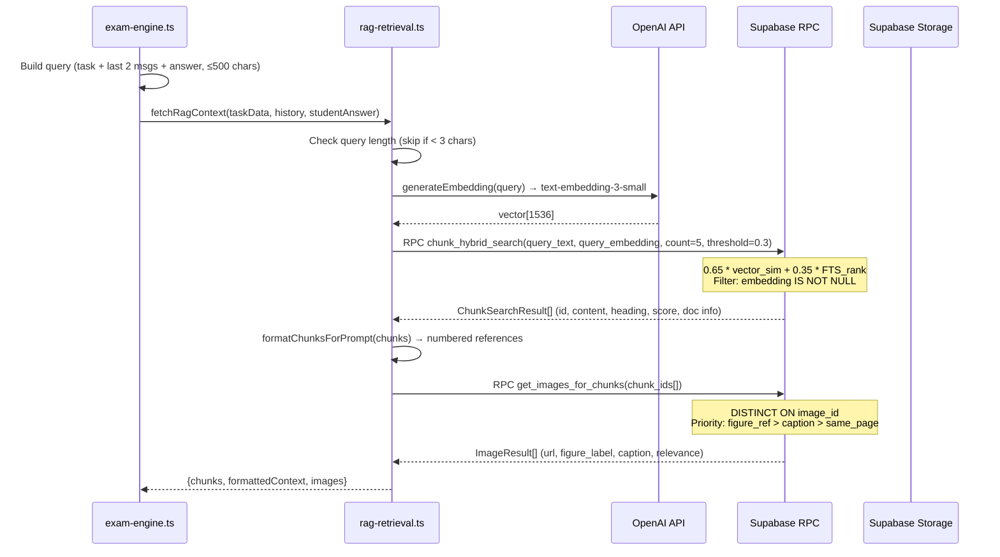

# Knowledge Base and Retrieval Pipeline

---

## Ingestion Pipeline

### Overview

The ingestion pipeline is a **multi-tool, multi-language offline process** that converts FAA PDF source documents into searchable, embeddable chunks with linked images. It runs locally via CLI scripts and writes directly to Supabase.



### Text Chunking Strategy

**File:** `scripts/ingest-sources.ts:260-309`

| Parameter | Value | Rationale |
|-----------|-------|-----------|
| Max tokens | 800 | ~3200 chars; balances context window usage vs specificity |
| Overlap | 100 tokens | ~400 chars carry-over prevents hard boundary splits |
| Split boundary | `\n{2,}` (paragraph breaks) | Preserves paragraph integrity |
| Min final chunk | 50 chars | Prevents tiny trailing fragments |
| Token estimate | 4 chars/token | Rough heuristic (not tiktoken) |
| Content hash | SHA-256 | Deduplication + change detection |
| Heading extraction | First line < 100 chars | Heuristic: starts with chapter/section/number or is ALL-CAPS |

> [!risk] Chunking Accuracy Risks
> - **Token estimate is rough** (4 chars/token). Aviation text with abbreviations and numbers may have different tokenization ratios, potentially creating chunks that exceed the 800-token target.
> - **No page tracking in TypeScript ingestion** — `page_start`/`page_end` columns exist but are NOT populated by `ingest-sources.ts`. Only `ingest_text.py` populates them. This means the `same_page` image linking strategy has no data for most chunks.
> - **No metadata filtering** — chunks don't store `acs_task_ids`, `aircraft_class`, or `certificate_level`. All filtering happens post-retrieval.
> - **Heading extraction is heuristic** — may miss headings in non-standard formats, leading to poor chunk labeling.

### Image Extraction

**File:** `scripts/extract-images/extract.py` (763 lines)

- **Phase A:** Embedded image extraction from PDFs via PyMuPDF
  - Quality filter: MIN 100×100px, 5KB, aspect ratio ≤ 10:1
  - SHA-256 deduplication within and across runs
  - Figure label detection via regex in ±50pt bounding box
  - Caption extraction from 80pt below image
  - Category classification: diagram, chart, table, instrument, weather, performance, sectional, airport
  - Format optimization: large (>500KB) → WebP, transparent → PNG, default → JPEG
- **Phase B:** Page rendering at 200 DPI for chart-style content (Testing Supplement)
- **Page backfill:** Multi-anchor text matching (3 anchors × ±10 pages) for chunk-page assignment

### Image Linking

**File:** `scripts/extract-images/link_images.py`

Three strategies, each creating `chunk_image_links` rows:

| Strategy | Relevance Score | Method |
|----------|----------------|--------|
| `figure_ref` | 0.9 (fixed) | Regex matches "Figure X-Y" in chunk text → `source_images.figure_label` |
| `caption_match` | overlap % (≥0.30) | Word-level overlap between caption keywords (4+ chars) and chunk content |
| `same_page` | 0.5 (fixed) | Page number match — **only works if chunk has page data** |

**Private Pilot Run Stats (documented in `KNOWLEDGE_ONBOARDING_PROCEDURE.md`):**
- 1,408 images in database
- 7,533 chunk-image links

---

## Retrieval Pipeline

### Query Construction

**File:** `src/lib/exam-engine.ts:157-180`

```
query = `${task.task} ${last2Messages.join(' ')} ${studentAnswer}`.slice(0, 500)
```

The query combines:
1. Current ACS task description
2. Last 2 messages from conversation history
3. Student's answer

Truncated to 500 characters. No query expansion, rewriting, or decomposition.

> [!risk] Query Construction Weakness
> The 500-char truncation and simple concatenation mean:
> - Long student answers may crowd out task context
> - No synonym expansion for aviation abbreviations (METAR, TAF, VOR, DME)
> - No distinction between "what the student said" and "what we need to verify"

### Embedding Generation

**File:** `src/lib/rag-retrieval.ts:27-37`

- Model: `text-embedding-3-small` (1536 dimensions)
- Single embedding per query (no batch for retrieval)
- No caching of embeddings

### Hybrid Search RPC

**File:** Supabase migration `20260215000001_fix_search_path.sql`

```sql
chunk_hybrid_search(
  query_text TEXT,
  query_embedding VECTOR(1536),
  match_count INT DEFAULT 6,
  similarity_threshold FLOAT DEFAULT 0.3,
  filter_doc_type TEXT DEFAULT NULL,
  filter_abbreviation TEXT DEFAULT NULL
)
```

**Scoring formula:**
```
score = 0.65 * (1 - cosine_distance(embedding, query_embedding))
      + 0.35 * normalized_ts_rank(fts, plainto_tsquery(query_text))
```

- Filters: `embedding IS NOT NULL`, cosine similarity > threshold
- Optional: `doc_type` and `abbreviation` filters (not currently used in retrieval calls)
- Returns: `id, document_id, heading, content, page_start, page_end, doc_title, doc_abbreviation, score`

> [!decision] Hybrid Search Weights
> The 0.65/0.35 vector/FTS split was likely chosen to favor semantic similarity while giving meaningful weight to keyword matches. For aviation text with precise terminology (regulation numbers, specific values), higher FTS weight may improve precision.

### Image Retrieval

**File:** `src/lib/rag-retrieval.ts:120-145`

After chunk retrieval, `getImagesForChunks(chunkIds)` fetches linked images:
- Calls `get_images_for_chunks` RPC with chunk UUID array
- `DISTINCT ON (si.id)` prevents duplicate images
- Priority: `figure_ref` (3) > `caption_match` (2) > `same_page` (1)
- Constructs public URLs from Supabase Storage

### Context Injection

**File:** `src/lib/rag-retrieval.ts:80-118`

RAG context is formatted as numbered references:
```
[1] PHAK — Chapter 15: Airspace (p.15-3)
<chunk content>

[2] AIM — Section 3-2-6 (p.3-2-12)
<chunk content>
```

Injected into the examiner system prompt as:
```
FAA SOURCE MATERIAL (use to ask accurate, specific questions):
[formatted chunks]
```

Images (up to 3) are passed as multimodal content in the assessment call (vision-capable) and as SSE events to the client for display.

---

## Retrieval Flow (Sequence Diagram)



---

## Accuracy Risks & Improvement Opportunities

### Risk 1: No Reranking
**Current state:** Hybrid search returns top 5 results by combined score. No cross-encoder reranking.
**Impact:** Relevant chunks may be displaced by semantically similar but topically wrong results.
**Improvement:** Add a lightweight reranker (e.g., Cohere Rerank API, or a small cross-encoder) between retrieval and injection.
**Code touchpoint:** `src/lib/rag-retrieval.ts:39-78` (after `searchChunks`, before `formatChunksForPrompt`)

### Risk 2: No Chunk Metadata Filtering
**Current state:** The RPC supports `filter_doc_type` and `filter_abbreviation` but these are **never passed** from the application code.
**Impact:** CFR-specific questions may retrieve handbook paraphrases instead of regulatory text.
**Improvement:** Use task metadata (from `acs_tasks`) to bias retrieval toward authoritative sources. E.g., regulation questions → filter to `cfr` + `aim`.
**Code touchpoint:** `src/lib/exam-engine.ts:157-180` (query builder), `src/lib/rag-retrieval.ts:39` (searchChunks options)

### Risk 3: No Citation Verification
**Current state:** RAG chunks are injected into the prompt, but the LLM's claims are not verified against the retrieved sources.
**Impact:** The model may paraphrase incorrectly, cite wrong numbers, or ignore retrieved evidence.
**Improvement:** Post-generation claim verification (lightweight entailment check against retrieved chunks).
**Code touchpoint:** New module, called after `generateExaminerTurn` completes.

### Risk 4: Query Quality
**Current state:** Simple concatenation of task + history + answer, truncated to 500 chars.
**Impact:** Poor query quality for complex multi-concept questions.
**Improvement:** Separate retrieval queries for (a) task context, (b) student answer verification, (c) follow-up topic lookup.
**Code touchpoint:** `src/lib/exam-engine.ts:157-180`

### Risk 5: Source Currency
**Current state:** `source_documents` has `edition_date` column but no `valid_until` or deprecation mechanism.
**Impact:** If FAA updates a regulation or handbook chapter, stale chunks remain in the index with no differentiation.
**Improvement:** Add `deprecated_at` column; filter in hybrid search; schedule currency checks.
**Code touchpoint:** Supabase migration + RPC modification

### Risk 6: Empty Knowledge Graph
**Current state:** `concepts` and `concept_relations` tables are schemaed and indexed but contain zero rows.
**Impact:** The system cannot leverage graph traversal for topic connections, prerequisite chains, or DPE-like probing.
**Improvement:** See [[06 - GraphRAG Proposal for Oral Exam Flow]].

---

## Where to Change What

| Change | File(s) | Function(s) |
|--------|---------|-------------|
| Modify query construction | `src/lib/exam-engine.ts` | `fetchRagContext():157-180` |
| Change search parameters (count, threshold) | `src/lib/rag-retrieval.ts` | `searchChunks():39-78` |
| Add reranking | `src/lib/rag-retrieval.ts` | New function after `searchChunks` |
| Enable metadata filtering | `src/lib/rag-retrieval.ts` | Pass `filterDocType`/`filterAbbreviation` options |
| Modify hybrid search weights | Supabase migration | `chunk_hybrid_search` RPC |
| Add embedding cache | `src/lib/rag-retrieval.ts` | Wrap `generateEmbedding()` |
| Change chunk size/overlap | `scripts/ingest-sources.ts` | `chunkText():260-309` |
| Add page tracking | `scripts/ingest-sources.ts` | Modify main pipeline loop |
| Register new source docs | `scripts/ingest-sources.ts` | `buildDocumentRegistry():56-258` |
| Add new image sources | `scripts/extract-images/extract.py` | Directory iteration + config |
| Modify image linking | `scripts/extract-images/link_images.py` | Strategy functions |

---

*See also: [[02 - Current Architecture Map]], [[06 - GraphRAG Proposal for Oral Exam Flow]], [[05 - Latency Audit and Instrumentation Plan]]*
