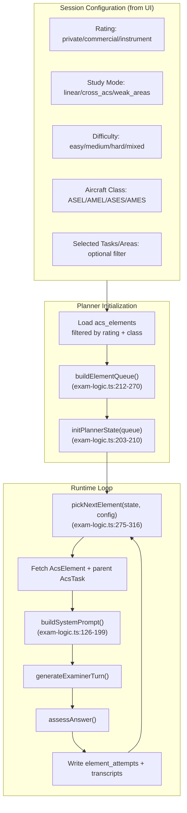
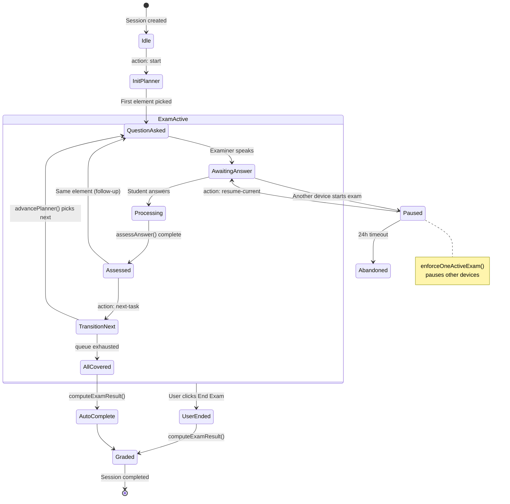

# Exam Flow Engine

---

## How Sequencing Works Now

The exam flow is driven by a **cursor-based element planner** that operates at the ACS element level (not task level). The planner is deterministic — given the same config and state, it produces the same next element.

### Architecture



### PlannerState Structure

**File:** `src/types/database.ts:226-232`

```typescript
interface PlannerState {
  version: number;        // Incremented on every advance
  queue: string[];        // Element codes (e.g., "PA.I.A.K1")
  cursor: number;         // Current position in queue
  recent: string[];       // Last 5 elements (anti-repetition)
  attempts: Record<string, number>; // Per-element attempt count
}
```

State is persisted in `exam_sessions.metadata` (JSONB) and passed between client and server on every API call.

### Queue Building: `buildElementQueue()`

**File:** `src/lib/exam-logic.ts:212-270`

1. Receives `AcsElement[]`, `SessionConfig`, and optional `ElementScore[]` (for weak areas)
2. Filters by `selectedTasks` or `selectedAreas` if provided
3. **Removes `skill` type elements** (only `knowledge` and `risk` types are oral-testable)
4. Orders based on `studyMode`:

| Mode | Ordering | Description |
|------|----------|-------------|
| `linear` | Alphabetical by `code` | Sequential: `PA.I.A.K1, PA.I.A.K2, ... PA.I.B.K1, ...` |
| `cross_acs` | Fisher-Yates shuffle | Random permutation across all areas |
| `weak_areas` | Weighted shuffle | Unsatisfactory=5, partial=4, untouched=3, satisfactory=1 |

### Element Selection: `pickNextElement()`

**File:** `src/lib/exam-logic.ts:275-316`

1. Scans from `cursor` position forward through `queue`
2. Skips elements in `state.recent` (last 5) — **anti-repetition window**
3. On match: updates `cursor`, adds to `recent` (trimmed to 5), increments `attempts[elementCode]`, bumps `version`
4. If full queue scan finds nothing (all in recent): returns `null` → triggers auto-complete

### Task Transition: `advancePlanner()`

**File:** `src/lib/exam-planner.ts:97-148`

1. Calls `pickNextElement()` (pure function)
2. Fetches the `AcsElement` row + its parent `AcsTask` row from Supabase
3. Determines difficulty (if `mixed`, uses `element.difficulty_default`)
4. Calls `buildSystemPrompt()` with task data
5. Returns `PlannerResult` with all context needed for generation

### Auto-Completion & Grading

**File:** `src/lib/exam-logic.ts:344-388`

When the planner exhausts the queue OR user clicks "End Exam":

```typescript
function computeExamResult(
  attemptData: ElementAttempt[],
  totalElements: number,
  trigger: 'all_tasks_covered' | 'user_ended'
): ExamResult
```

Grading logic:
- `incomplete` if `elementsAsked < totalElements`
- `unsatisfactory` if ANY element has `unsatisfactory` or `partial` score
- `satisfactory` only if ALL elements asked AND ALL satisfactory
- Returns per-area breakdown with counts

---

## Exam Flow State Machine



---

## Gaps & Opportunities

### Gap 1: No Adaptive Follow-Up Logic

**Current:** After assessment, the system always moves to the next element when the user clicks "Next Question." There is no automatic drilling down on weak answers or prerequisite probing.

**Impact:** A real DPE would probe deeper on unsatisfactory answers before moving on. The current system is more like a quiz than an oral exam.

**Opportunity:** Add a **drill-down mode** where unsatisfactory/partial scores trigger follow-up questions on the same element or its prerequisites before advancing.

**Code touchpoint:** `src/app/api/exam/route.ts:552-689` (next-task handler), `src/lib/exam-logic.ts:275-316` (pickNextElement)

### Gap 2: No Natural Topic Transitions

**Current:** Task transitions are abrupt. The examiner asks about the next element without connecting it to previous topics.

**Impact:** Feels mechanical. A DPE naturally bridges: "Since we talked about weather minimums, let's discuss how that affects your flight planning..."

**Opportunity:** Use knowledge graph `CROSS_REFERENCES` edges to generate bridging transitions. The full session history is already loaded from `session_transcripts` for task transitions (line 556-571 in exam route).

**Code touchpoint:** `src/lib/exam-engine.ts:187-255` (generateExaminerTurn — the system prompt could include transition context)

### Gap 3: No Cross-Area Probing

**Current:** `cross_acs` mode shuffles elements but doesn't intentionally create cross-topic connections (e.g., Weather → Flight Planning → Regulations → Weather).

**Impact:** Misses a key DPE technique: revealing whether the student can apply knowledge across domains.

**Opportunity:** Graph `REQUIRES` and `APPLIES_IN_SCENARIO` edges could drive scenario-based questioning that spans multiple ACS areas.

### Gap 4: Weak Areas Mode is Simplistic

**Current:** Weights are hardcoded: `unsatisfactory=5, partial=4, untouched=3, satisfactory=1`. The weighted shuffle provides probabilistic prioritization but no guarantees.

**Impact:** High-priority weak elements may not appear early enough. No mechanism to re-test previously satisfactory elements for retention.

**Opportunity:** Spaced repetition algorithm (SRS) for element scheduling across sessions. Track last attempt timestamp and success rate for decay-based prioritization.

**Code touchpoint:** `src/lib/exam-logic.ts:240-270` (weak areas weighting in `buildElementQueue`)

### Gap 5: No Difficulty Adaptation

**Current:** Difficulty is set at session start (`easy/medium/hard/mixed`). Within a session, `mixed` uses each element's `difficulty_default` but doesn't adapt based on student performance.

**Impact:** Strong students waste time on easy questions; weak students get overwhelmed by hard ones.

**Opportunity:** Dynamic difficulty adjustment within session based on rolling assessment scores (last N elements).

**Code touchpoint:** `src/lib/exam-planner.ts:97-148` (advancePlanner determines difficulty per element)

### Gap 6: No Scenario-Based Questioning

**Current:** Each element is tested in isolation. The examiner asks about one topic, assesses, moves to next.

**Impact:** Misses a key DPE technique: presenting a flight scenario and threading multiple ACS elements through it.

**Opportunity:** Create `scenario_template` nodes in the knowledge graph that link multiple elements. The planner could select a scenario that covers several pending elements simultaneously.

---

## Coupling Points

| System | Coupling to Exam Flow | Interface |
|--------|----------------------|-----------|
| **RAG retrieval** | Called per exchange in `fetchRagContext()` | `exam-engine.ts:157-180` |
| **Practice UI** | Manages `plannerState` + `sessionConfig` in React state | `practice/page.tsx:77-137` |
| **Session API** | Persists `plannerState` in `exam_sessions.metadata` | `session/route.ts` |
| **Transcript DB** | Full history loaded for task transitions | `exam/route.ts:556-571` |
| **Element Attempts** | Written after each assessment | `exam/route.ts:473-497` |
| **Prompt System** | Loads rating/difficulty/mode-specific prompts | `exam-engine.ts:62-96` |
| **Kill Switch** | Gates exam start/respond | `exam/route.ts:168-175` |
| **Session Enforcement** | One active exam per user | `exam/route.ts:214-238` |

---

## ACS Task Coverage

| Rating | Prefix | Tasks | Elements (approx) | Oral Areas |
|--------|--------|-------|--------------------|----|
| Private Pilot | `PA` | 61 | ~250+ K+R elements | 10 of 12 areas |
| Commercial | `CA` | 60 | ~200+ K+R elements | 7 of 12 areas |
| Instrument | `IR` | 22 | ~90+ K+R elements | 6 of 12 areas |
| ATP | `ATP` | 0 | Not seeded | — |

**Excluded areas** (flight skills only):
- Private: IV (Takeoffs/Landings), V (Performance Maneuvers)
- Commercial: specific flight maneuver areas
- Instrument: flight-skill areas

**Element filtering:** `src/lib/exam-logic.ts:25-56` (`ORAL_EXAM_AREA_PREFIXES`)

---

*See also: [[02 - Current Architecture Map]], [[06 - GraphRAG Proposal for Oral Exam Flow]], [[07 - Optimization Roadmap]]*
