# Latency Audit and Instrumentation Plan

---

## Current Latency Budget (Estimated)

The system has **no instrumentation** — the `latency_logs` table exists but is never populated. All estimates below are based on code analysis and typical API latencies.

### Critical Path: Student Answer → First Token

```mermaid
gantt
    title Estimated Latency Budget (Streaming Path)
    dateFormat X
    axisFormat %L ms

    section Middleware
    Rate limit + auth refresh       :0, 20

    section Parallel Phase 1
    INSERT student transcript       :20, 70
    Build RAG query (500 chars)     :20, 25
    OpenAI embedding (3-small)      :25, 275
    Supabase hybrid search RPC      :275, 475
    Get images for chunks           :475, 550

    section LLM Streaming
    Build system prompt             :550, 560
    Claude API connection (TTFT)    :560, 1300
    First token streamed to client  :1300, 1310

    section Parallel Assessment
    Assessment Claude call          :550, 2500
```



### Estimated Component Latencies

| Component | Operation | Estimated p50 | Estimated p95 | Evidence |
|-----------|-----------|---------------|---------------|----------|
| **Middleware** | Rate limit + session refresh | 10ms | 30ms | In-memory map + Supabase cookie check |
| **DB Write** | INSERT student transcript | 30ms | 80ms | Single Supabase insert |
| **Embedding** | OpenAI text-embedding-3-small | 150ms | 300ms | Single API call, 500 chars |
| **Hybrid Search** | chunk_hybrid_search RPC | 100ms | 250ms | pgvector + FTS, top 5 |
| **Image Fetch** | get_images_for_chunks RPC | 50ms | 120ms | UUID array lookup + join |
| **System Config** | getSystemConfig() | 30ms | 80ms | SELECT * from system_config (fresh every time) |
| **Kill Switch** | checkKillSwitch() | <1ms | <1ms | Pure function on config data |
| **Prompt Build** | buildSystemPrompt() + loadPromptFromDB() | 40ms | 100ms | DB query for prompt_versions |
| **Claude TTFT** | First token from Claude Sonnet | 500ms | 1200ms | Streaming, max_tokens=500 |
| **Claude Assessment** | Full assessment response | 800ms | 2000ms | Non-streaming, max_tokens=400, JSON |
| **TTS Synthesis** | Deepgram TTS | 200ms | 500ms | Network + synthesis |
| **TTS TTFA** | Time to first audio byte | 300ms | 800ms | Provider-dependent |

### Total Estimated Latencies

| Metric | Streaming Path | Non-Streaming Path |
|--------|---------------|-------------------|
| **First token to client** | **~1.0-1.5s (p50), ~2.0-3.0s (p95)** | N/A |
| **Full examiner response** | ~2.5-4.0s (p50) | ~2.5-4.0s (p50) |
| **Assessment available** | ~2.0-3.0s (p50, parallel) | ~2.5-4.0s (p50, sequential with examiner) |
| **First audio (voice users)** | +300-800ms after full text | +300-800ms |
| **Complete exchange** | ~3.0-5.0s | ~4.0-6.0s |

> [!risk] Unverified Estimates
> These are estimates based on typical API latencies. **No actual measurements exist.** The first priority must be adding instrumentation.

---

## All Latency Contributors

### 1. Pre-LLM Phase (Blocking)

| Step | Location | Current State | Cacheable? |
|------|----------|---------------|------------|
| Rate limit check | `src/middleware.ts:15-68` | In-memory map | N/A (fast) |
| Auth session refresh | `src/lib/supabase/middleware.ts` | Cookie check + Supabase | No (security) |
| getSystemConfig() | `src/lib/system-config.ts` | Fresh DB query every time | **Yes — TTL 60s** |
| getUserTier() | `src/lib/voice/tier-lookup.ts` | Fresh DB query every time | **Yes — session-scoped** |
| Kill switch check | `src/lib/kill-switch.ts` | Pure function | N/A (instant) |
| Session enforcement | `src/lib/session-enforcement.ts` | DB upsert + query | Minimal savings |
| User profile load | `src/app/api/exam/route.ts:195-211` | DB query for persona + name | **Yes — session-scoped** |

### 2. RAG Phase (Partially Parallelizable)

| Step | Location | Current State | Cacheable? |
|------|----------|---------------|------------|
| Query construction | `src/lib/exam-engine.ts:157-180` | String concat + truncate | N/A (instant) |
| Embedding generation | `src/lib/rag-retrieval.ts:27-37` | OpenAI API call every time | **Yes — query hash** |
| Hybrid search | Supabase RPC | pgvector + FTS, top 5 | **Yes — query hash, 5-30min TTL** |
| Image lookup | Supabase RPC | UUID array join | **Yes — chunk-ID based** |
| Format chunks | `src/lib/rag-retrieval.ts:80-118` | String formatting | **Yes — chunk-ID based** |

### 3. LLM Phase

| Step | Location | Current State | Cacheable? |
|------|----------|---------------|------------|
| Prompt assembly | `src/lib/exam-engine.ts` | loadPromptFromDB + buildSystemPrompt | **Partially — base prompt** |
| Examiner generation | Claude Sonnet 4.6 | Streaming, max_tokens=500 | No (dynamic) |
| Assessment | Claude Sonnet 4.6 | Non-streaming, max_tokens=400 | No (dynamic) |

### 4. Post-LLM Phase (Background)

| Step | Location | Current State | Blocking? |
|------|----------|---------------|-----------|
| Write examiner transcript | DB insert | Background after stream | No |
| Write assessment to student transcript | DB update | Background | No |
| Write element_attempts | DB inserts | Background | No |
| Write transcript_citations | DB inserts | Background | No |

### 5. Voice Phase (Additional for voice users)

| Step | Location | Current State | Cacheable? |
|------|----------|---------------|------------|
| TTS quota check | DB count query | Per-request | **Yes — session-scoped** |
| TTS synthesis | Provider API (Deepgram/Cartesia/OpenAI) | Per-utterance | No |
| Audio playback start | Browser | Client-side | N/A |

---

## Instrumentation Plan

### Proposed Tracing Spans

Add timing spans to the following code locations. Use a simple `performance.now()` approach initially (no external tracing service needed).

| Span Name | Start Location | End Location | Metric |
|-----------|---------------|--------------|--------|
| `middleware.total` | `src/middleware.ts:5` | Before return | Total middleware time |
| `middleware.rateLimit` | Before `checkRateLimit()` | After | Rate limit check |
| `exam.preChecks` | `route.ts:168` | Before streaming starts | Config + kill switch + enforcement |
| `rag.total` | `exam-engine.ts:157` | After `fetchRagContext()` | Total RAG time |
| `rag.embedding` | `rag-retrieval.ts:27` | After OpenAI call | Embedding generation |
| `rag.hybridSearch` | Before RPC call | After | Supabase hybrid search |
| `rag.imageSearch` | Before RPC call | After | Image retrieval |
| `llm.examiner.ttft` | Before `anthropic.messages.stream()` | First `content_block_delta` | Time to first token |
| `llm.examiner.total` | Before stream | After `message_stop` | Total examiner generation |
| `llm.assessment.total` | Before `assessAnswer()` | After response | Total assessment time |
| `prompt.load` | Before `loadPromptFromDB()` | After | DB prompt lookup + scoring |
| `tts.total` | TTS API start | Audio buffer ready | TTS synthesis time |
| `tts.ttfb` | TTS API start | First audio byte | Time to first audio byte |

### Implementation Approach

```typescript
// src/lib/timing.ts (new file)
type TimingSpan = { name: string; start: number; end?: number; durationMs?: number };

export function createTimingContext() {
  const spans: TimingSpan[] = [];
  return {
    start(name: string) { spans.push({ name, start: performance.now() }); },
    end(name: string) {
      const span = spans.find(s => s.name === name && !s.end);
      if (span) { span.end = performance.now(); span.durationMs = span.end - span.start; }
    },
    getSpans() { return spans; },
    toJSON() { return Object.fromEntries(spans.map(s => [s.name, s.durationMs ?? null])); }
  };
}
```

### Logging Destination

Write timing data to the existing `latency_logs` table (currently empty):

```sql
-- Already exists in schema
INSERT INTO latency_logs (session_id, exchange_number, timings)
VALUES ($1, $2, $3::jsonb);
```

This populates the table that was designed for this purpose but never wired up.

### Dashboard Query

```sql
-- p50/p95/p99 for each span
SELECT
  key AS span_name,
  percentile_cont(0.50) WITHIN GROUP (ORDER BY (value::numeric)) AS p50,
  percentile_cont(0.95) WITHIN GROUP (ORDER BY (value::numeric)) AS p95,
  percentile_cont(0.99) WITHIN GROUP (ORDER BY (value::numeric)) AS p99
FROM latency_logs,
  jsonb_each_text(timings) AS t(key, value)
WHERE created_at > now() - interval '24 hours'
GROUP BY key
ORDER BY p95 DESC;
```

---

## Quick Wins (Implement Now)

### QW1: System Config Caching
**Current:** `getSystemConfig()` queries DB on every API call. Serverless note: "No cache — instances don't share memory."
**Fix:** Module-level cache with 60-second TTL. Even cold-start Lambda reuse benefits from this.
**Savings:** ~30-80ms per request
**Effort:** S (10 lines)
**File:** `src/lib/system-config.ts`

### QW2: Embedding Cache in Supabase
**Current:** Every RAG query generates a fresh embedding via OpenAI API.
**Fix:** Cache `hash(normalized_query) → embedding` in a `embedding_cache` table. Check before calling OpenAI.
**Savings:** ~150-300ms when cache hits (aviation queries often repeat similar patterns)
**Effort:** S-M (new table + wrapping `generateEmbedding`)
**File:** `src/lib/rag-retrieval.ts:27-37`

### QW3: Prompt Template Pre-Loading
**Current:** `loadPromptFromDB()` queries `prompt_versions` on every exam request.
**Fix:** Cache published prompts in module memory with 5-minute TTL. Prompts change rarely.
**Savings:** ~30-100ms per request
**Effort:** S (20 lines)
**File:** `src/lib/exam-engine.ts:62-96`

### QW4: User Tier + Profile Caching
**Current:** `getUserTier()` and profile data queried fresh per request.
**Fix:** Session-scoped cache (pass through from first call, or module-level with user-keyed map + 5min TTL).
**Savings:** ~30-80ms per request
**Effort:** S
**Files:** `src/lib/voice/tier-lookup.ts`, `src/app/api/exam/route.ts:195-211`

### QW5: Parallel Pre-Checks
**Current:** Some pre-checks run sequentially in the `respond` handler.
**Fix:** Ensure `getSystemConfig()`, `getUserTier()`, profile load, and session enforcement all run in `Promise.all()`.
**Savings:** ~50-150ms (eliminating sequential waits)
**Effort:** S
**File:** `src/app/api/exam/route.ts:168-240`

### QW6: TTS Sentence-Level Streaming
**Current:** Full examiner text is sent to TTS after stream completes.
**Fix:** Start TTS as soon as first complete sentence is available (use existing `detectSentenceBoundary()` from `sentence-boundary.ts`). Stream audio while LLM continues generating.
**Savings:** ~500-2000ms reduction in time-to-first-audio for voice users
**Effort:** M (requires client-side audio queue management)
**Files:** `src/app/api/tts/route.ts`, `src/app/(dashboard)/practice/page.tsx`

---

## Deeper Refactors (Plan Next)

### DR1: "Immediate Reaction" Streaming Pattern
**Description:** Start streaming a safe acknowledgment from Claude immediately (no RAG), then inject RAG context as a continuation after retrieval completes.
**Mechanism:** Two-phase prompt: Phase 1 = "Acknowledge and set up" (no citations), Phase 2 = "Ground with evidence" (after RAG arrives).
**Expected Impact:** First token in <500ms consistently
**Effort:** L (requires prompt redesign + streaming controller refactoring)

### DR2: Retrieval Result Cache
**Description:** Cache `query_hash → {chunk_ids, scores}` with 5-30 minute TTL.
**Mechanism:** Supabase table or Upstash Redis.
**Expected Impact:** Skip embedding + search for repeated/similar queries
**Effort:** M
**File:** `src/lib/rag-retrieval.ts`

### DR3: Topic Prefetching
**Description:** After examiner asks a question, immediately prefetch RAG results for that question text.
**Mechanism:** When `generateExaminerTurn` completes, embed the examiner's question and run retrieval in the background. Store in session cache for the anticipated student response.
**Expected Impact:** Eliminate RAG latency from the next exchange
**Effort:** M-L

### DR4: pgvector Index Tuning
**Description:** Evaluate HNSW vs IVFFLAT index parameters for current corpus size.
**Mechanism:** Run benchmarks with HNSW `m=16, ef_construction=128` vs current defaults.
**Expected Impact:** 10-30% improvement in vector search latency
**Effort:** M (requires migration + benchmarking)

### DR5: Smaller Model for Assessment
**Description:** Use Claude Haiku or similar for the assessment call (structured JSON output, simpler reasoning).
**Mechanism:** Change model in `assessAnswer()` from `claude-sonnet-4-6` to a faster model.
**Expected Impact:** ~200-500ms reduction in assessment latency
**Risk:** May reduce assessment accuracy — requires evaluation
**Effort:** S (config change), M (evaluation)
**File:** `src/lib/exam-engine.ts:367-510`

---

## Impact/Effort Summary

| Change | Effort | Expected Savings | Risk |
|--------|--------|-----------------|------|
| Instrumentation | S | Visibility (enables all other optimizations) | None |
| System config cache | S | 30-80ms | None |
| Embedding cache | S-M | 150-300ms (on cache hit) | None |
| Prompt cache | S | 30-100ms | Stale prompt risk (mitigated by TTL) |
| Profile/tier cache | S | 30-80ms | None |
| Parallel pre-checks | S | 50-150ms | None |
| TTS sentence streaming | M | 500-2000ms (voice users) | Audio stitching artifacts |
| Immediate reaction streaming | L | 300-800ms first token | Complexity, prompt redesign |
| Retrieval result cache | M | 100-250ms (on cache hit) | Stale results (mitigated by TTL) |
| Topic prefetching | M-L | 200-500ms (next exchange) | Wasted prefetches |
| pgvector tuning | M | 10-30% search speedup | Requires benchmarking |
| Smaller assessment model | S+M(eval) | 200-500ms | Quality regression risk |

---

*See also: [[01 - Tech Stack Inventory]], [[03 - Knowledge Base and Retrieval Pipeline]], [[07 - Optimization Roadmap]]*
