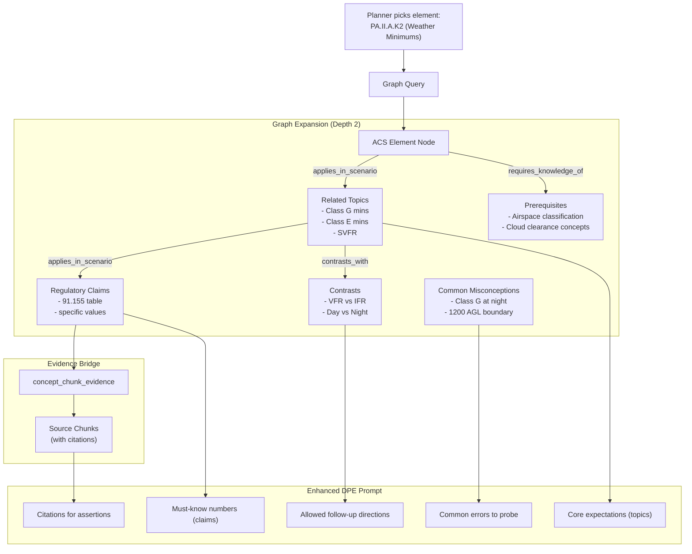

# GraphRAG Proposal for Oral Exam Flow

> [!info] Evidence Level: Medium
> This proposal synthesizes recommendations from Gemini 3.0 Pro and GPT-5.2 (see [[08 - PAL MCP Research Log]]) with the verified codebase architecture. The GraphRAG design itself is prospective — not yet validated with real data.

---

## Why GraphRAG for Oral Exams

The current chunk-based RAG retrieves semantically similar text passages. This works for answering factual questions but fails at:

1. **Structured knowledge** — Weather minimums, airspace rules, and equipment requirements are conditional (altitude × day/night × airspace class). A chunk captures a paragraph; a graph captures the decision structure.
2. **DPE-like probing** — A DPE follows prerequisite chains ("If you don't know fuel requirements, do you understand basic weight and balance?"). This requires explicit prerequisite edges.
3. **Cross-topic connections** — A DPE bridges topics naturally ("Since we discussed alternates, let's talk about fuel reserves — how are they connected?"). This requires cross-reference edges.
4. **Citation precision** — Chunk RAG may retrieve a 300-word paragraph containing the answer somewhere. GraphRAG retrieves the specific claim + its citation.

---

## Graph Schema

### Design Principles

- **Build on existing infrastructure** — Use the existing `concepts` + `concept_relations` tables in Supabase
- **Stay PostgreSQL-native** — No Neo4j or separate graph DB
- **Bridge to chunks** — The graph enhances chunk RAG, not replaces it
- **Match existing relation types** — Map to the 6 defined types where possible

### Existing Relation Types (from `src/types/database.ts:3-9`)

```typescript
type RelationType =
  | 'requires_knowledge_of'    // Prerequisite chains
  | 'leads_to_discussion_of'   // DPE flow transitions
  | 'is_component_of'          // Part-whole hierarchy
  | 'contrasts_with'           // Comparison pairs
  | 'mitigates_risk_of'        // Risk management links
  | 'applies_in_scenario';     // Scenario-based testing
```

These map well to the consensus recommendations from both models.

### Node Types (via `concepts.category` column)

| Node Type | Description | Example | Approximate Count |
|-----------|-------------|---------|-------------------|
| `acs_element` | Mirrors `acs_elements` table | PA.I.A.K1 (Certificates & Documents) | ~500 (mapped from DB) |
| `topic` | Core aviation knowledge concept | "Class E Airspace", "Left Turning Tendencies" | ~500-1000 |
| `regulatory_claim` | Atomic, citable FAA rule with structured metadata | "VFR Day Class G ≤1200 AGL: 1 SM, clear of clouds" | ~200-500 |
| `definition` | Canonical definition | "MEL: Minimum Equipment List" | ~100-200 |
| `procedure` | Step-by-step operational procedure | "Lost Communications IFR", "Short-field Takeoff" | ~100-200 |
| `artifact` | FAA document reference | "PHAK Ch 15", "14 CFR 91.155", "AIM 3-2-6" | ~300-500 |

### Edge Types (mapped to existing `RelationType`)

| Existing Type | GraphRAG Usage | Direction | Example |
|--------------|---------------|-----------|---------|
| `requires_knowledge_of` | Prerequisite chains | topic → prerequisite topic | "Spin Recovery" requires "Stall Aerodynamics" |
| `leads_to_discussion_of` | DPE flow transitions | topic → related topic | "Weather Services" leads to "Flight Planning" |
| `is_component_of` | Part-whole hierarchy | topic → parent topic | "Class E" is component of "Airspace" |
| `contrasts_with` | Comparison pairs | topic ↔ topic | "VFR" contrasts with "SVFR" |
| `mitigates_risk_of` | Risk management links | procedure → risk | "IMSAFE Checklist" mitigates "Aeromedical Factors" |
| `applies_in_scenario` | Scenario-based connections | regulatory_claim → topic | "91.155" applies in "VFR Weather Minimums" |

### Evidence Bridge (New Join Table)

```sql
CREATE TABLE concept_chunk_evidence (
  id UUID PRIMARY KEY DEFAULT gen_random_uuid(),
  concept_id UUID NOT NULL REFERENCES concepts(id),
  chunk_id UUID NOT NULL REFERENCES source_chunks(id),
  evidence_type TEXT NOT NULL CHECK (evidence_type IN ('primary', 'secondary', 'example', 'counterexample')),
  quote TEXT,           -- Exact excerpt if available
  page_ref TEXT,        -- e.g., "PHAK 15-3"
  confidence FLOAT NOT NULL DEFAULT 0.5,
  created_by TEXT NOT NULL DEFAULT 'pipeline',
  created_at TIMESTAMPTZ DEFAULT now(),
  UNIQUE (concept_id, chunk_id, evidence_type)
);

CREATE INDEX idx_cce_concept ON concept_chunk_evidence(concept_id);
CREATE INDEX idx_cce_chunk ON concept_chunk_evidence(chunk_id);
```

### Regulatory Claim Metadata Schema

Store structured claim data in `concepts.key_facts` (JSONB):

```json
{
  "domain": "weather_minimums",
  "airspace_class": "G",
  "altitude_band": "below_1200_agl",
  "day_night": "day",
  "visibility_sm": 1,
  "cloud_clearance": "clear_of_clouds",
  "cfr_reference": "14 CFR 91.155",
  "effective_date": "2024-01-01"
}
```

This allows **computed answers** for conditional rules rather than relying on LLM generation.

---

## Population Strategy

### Phase 1: ACS Skeleton (Deterministic — Week 1)

Create nodes for every ACS element already in `acs_elements` table.

```sql
INSERT INTO concepts (name, category, key_facts, validation_status)
SELECT
  e.description,
  'acs_element',
  jsonb_build_object('element_code', e.code, 'task_id', e.task_id, 'element_type', e.element_type),
  'validated'
FROM acs_elements e
ON CONFLICT DO NOTHING;
```

Then create `is_component_of` edges between elements and their parent tasks, and between tasks and their areas.

**Effort:** S — pure SQL migration
**Output:** ~500 nodes, ~500 edges

### Phase 2: Regulatory Layer (Semi-Automated — Week 1-2)

Extract regulatory claims from CFR and AIM chunks using Claude:

**Extraction prompt:**
```
Given this FAA text chunk, extract each regulatory requirement as a structured claim:
- The exact rule (what is required/prohibited)
- CFR or AIM reference
- Conditions under which it applies (airspace, altitude, day/night, etc.)
- Any numeric thresholds

Return JSON array of claims. Only extract explicit requirements, not commentary.
```

**Process:**
1. Filter `source_chunks` to `doc_type IN ('cfr', 'aim')`
2. Send each chunk to Claude (batch, not realtime)
3. Parse JSON output → create `regulatory_claim` nodes + `concept_chunk_evidence` links
4. Mark all as `validation_status = 'pending'`

**Effort:** M — script development + batch processing
**Output:** ~200-500 claim nodes

### Phase 3: Topic Extraction (Automated — Week 2-3)

Extract topic and definition nodes from PHAK, AFH, and handbook chunks:

**Process:**
1. Use heading structure from chunks (already extracted as `heading` column)
2. LLM pass to extract key concepts, definitions, and procedures
3. Create edges: `requires_knowledge_of`, `leads_to_discussion_of`, `is_component_of`
4. Link topics to ACS elements via `applies_in_scenario` edges

**Effort:** M-L — prompt engineering + quality review
**Output:** ~500-1000 topic nodes, ~2000-5000 edges

### Phase 4: Human Curation (Ongoing — Week 3+)

Priority curation for checkride-critical domains:

1. **P0 — Weather minimums, airspace rules, right-of-way** (highest risk of hallucination)
2. **P1 — Endorsements, currency, required documents, inspections** (regulatory precision)
3. **P2 — Performance, W&B, systems, ADM** (conceptual accuracy)

**Process:** Admin verification queue UI showing candidate claims with source evidence. Reviewer approves/edits and sets `validation_status = 'validated'`.

---

## Traversal & Integration with Exam Planner

### How the Graph Enhances Each Element

When the planner selects an ACS element, the graph provides a **context bundle**:



### RPC for Graph-Enhanced Retrieval

Extend the existing `get_related_concepts` RPC:

```sql
CREATE OR REPLACE FUNCTION get_concept_bundle(
  element_code TEXT,
  max_depth INT DEFAULT 2
) RETURNS TABLE (
  concept_id UUID,
  concept_name TEXT,
  concept_category TEXT,
  key_facts JSONB,
  depth INT,
  relation_type TEXT,
  evidence_chunks JSONB  -- [{chunk_id, content, doc_title, page_ref}]
) LANGUAGE sql AS $$
  WITH RECURSIVE graph AS (
    -- Anchor: find concept node for ACS element
    SELECT c.id, c.name, c.category, c.key_facts, 0 AS depth,
           NULL::text AS relation_type, ARRAY[c.id] AS path
    FROM concepts c
    WHERE c.category = 'acs_element'
      AND c.key_facts->>'element_code' = element_code
      AND c.validation_status = 'validated'

    UNION ALL

    -- Traverse
    SELECT nc.id, nc.name, nc.category, nc.key_facts, g.depth + 1,
           cr.relation_type, g.path || nc.id
    FROM graph g
    JOIN concept_relations cr ON g.id = cr.source_concept_id
    JOIN concepts nc ON cr.target_concept_id = nc.id
    WHERE g.depth < max_depth
      AND nc.id != ALL(g.path)  -- prevent cycles
      AND nc.validation_status IN ('validated', 'pending')
  )
  SELECT g.id, g.name, g.category, g.key_facts, g.depth, g.relation_type,
    (SELECT jsonb_agg(jsonb_build_object(
      'chunk_id', sc.id,
      'content', left(sc.content, 500),
      'doc_title', sd.title,
      'page_ref', 'p.' || sc.page_start
    ))
    FROM concept_chunk_evidence cce
    JOIN source_chunks sc ON cce.chunk_id = sc.id
    JOIN source_documents sd ON sc.document_id = sd.id
    WHERE cce.concept_id = g.id
    ORDER BY cce.confidence DESC
    LIMIT 3
    ) AS evidence_chunks
  FROM graph g
  ORDER BY g.depth, g.category;
$$;
```

### Integration Points

| Current Component | How Graph Enhances It | File |
|-------------------|----------------------|------|
| `advancePlanner()` | After selecting element, fetch concept bundle | `src/lib/exam-planner.ts:97-148` |
| `buildSystemPrompt()` | Inject structured claims + misconceptions + allowed directions | `src/lib/exam-logic.ts:126-199` |
| `generateExaminerTurn()` | Provide explicit transition context between topics | `src/lib/exam-engine.ts:187-255` |
| `assessAnswer()` | Compare student claims against verified `regulatory_claim` nodes | `src/lib/exam-engine.ts:367-510` |
| `fetchRagContext()` | Supplement chunk RAG with graph evidence | `src/lib/exam-engine.ts:157-180` |

---

## Adaptive Exam Flow via Graph

### Stack-Based Navigation (Proposed)

Replace the simple cursor with a **navigation stack** that allows drilling down on failures:

```typescript
interface GraphExamState extends PlannerState {
  stack: string[];       // Stack of concept node IDs to visit
  mode: 'assessment' | 'drill_down' | 'bridging';
  current_concept_id: string | null;
  mastery: Record<string, number>;  // concept_id → 0-1 mastery estimate
}
```

**Behavior:**
- **Satisfactory** → pop stack, push next planned element
- **Unsatisfactory** → follow `requires_knowledge_of` edges, push prerequisites onto stack
- **Task transition** → find `leads_to_discussion_of` path for natural bridging

### Example Flow

```
1. Planner selects: PA.II.A.K2 (Weather Minimums)
2. Graph provides: topics [Class G, Class E, SVFR], claims [91.155 values], prereqs [Airspace Classes]
3. DPE asks: "What are the VFR weather minimums for Class G airspace below 1200 AGL during the day?"
4. Student answers: "3 miles visibility and clear of clouds"

5. Assessment: SATISFACTORY (correct per 91.155 claim node)
6. DPE follow-up (from contrasts_with): "And how do those change at night?"
7. Student: "I think... 5 miles?"

8. Assessment: UNSATISFACTORY (91.155 says 3 SM, 500-1000-2000)
9. → DRILL DOWN: push prerequisite "cloud clearance concepts"
10. DPE: "Let's back up. Can you explain what cloud clearance means and why the FAA requires it?"

11. Student explains correctly
12. → Pop stack, return to night minimums
13. DPE: "Good. Now, knowing that — what are the night minimums in Class G below 1200?"
```

---

## Migration Plan

### Phase 0: Shadow Infrastructure (Week 1)
- Create `concept_chunk_evidence` table (migration)
- Add `category` column to `concepts` table if not already typed
- No production impact

### Phase 1: Background Population (Week 1-2)
- Run ACS skeleton population (SQL migration)
- Run regulatory claim extraction (batch script)
- Run topic extraction (batch script)
- Graph exists but is not queried by production code

### Phase 2: Shadow Mode (Week 2-3)
- On every `respond` action, run graph retrieval **in parallel** with chunk RAG
- Log both result sets to a `retrieval_comparison` table
- Compare: does graph context surface relevant info that chunks missed?
- **No user-visible changes**

### Phase 3: Hybrid Mode (A/B Test — Week 3-4)
- Feature flag in `system_config`: `graph_enhanced_retrieval.enabled`
- For flagged users: merge graph context + chunk context, deduplicate
- Metrics: assessment accuracy, user satisfaction, retrieval precision
- **Rollback:** disable feature flag → instant revert to pure chunk RAG

### Phase 4: Graph-First Navigation (Future)
- Implement stack-based navigation
- Use graph to drive exam flow, not just supplement context
- Requires more extensive planner refactoring

### Rollback Plan

At every phase, the system can revert to pure chunk RAG by:
1. Disabling the `graph_enhanced_retrieval` feature flag
2. The graph tables remain populated but unused
3. No schema changes required in rollback
4. Zero data loss

---

> [!decision] Build on Existing Schema
> The existing `concepts` + `concept_relations` tables with their 6 relation types are a strong foundation. No schema redesign needed — just populate the empty tables and add the `concept_chunk_evidence` bridge table.

> [!risk] Graph Quality Depends on Curation
> Automated extraction will produce a noisy graph. For checkride-critical domains (weather minimums, airspace, regulations), human curation of `regulatory_claim` nodes is essential before trusting the graph for assessment.

> [!todo] First Action
> Run the ACS skeleton population as a SQL migration. This is zero-risk and provides the backbone for all subsequent graph work.

---

*See also: [[03 - Knowledge Base and Retrieval Pipeline]], [[04 - Exam Flow Engine]], [[07 - Optimization Roadmap]], [[08 - PAL MCP Research Log]]*
