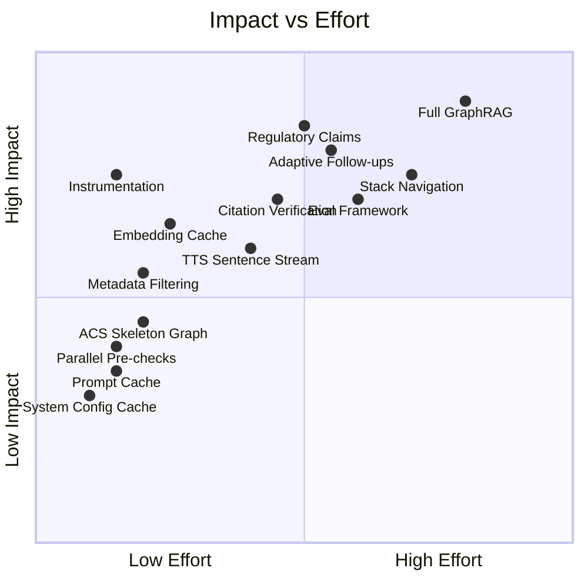
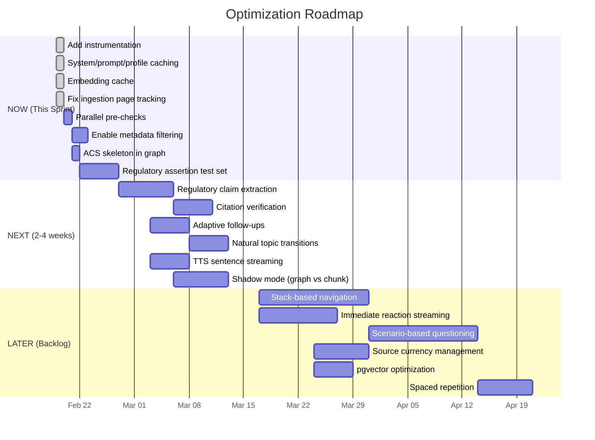

# Optimization Roadmap

---

## Priority Framework

Recommendations are organized into three tracks:
1. **Knowledge Correctness** — Reducing hallucinations, improving citation accuracy
2. **Exam Flow Quality** — Making the simulator feel like a real DPE oral
3. **Latency Reduction** — Faster responses, especially for voice users

Within each track, items are prioritized as **NOW** (this sprint), **NEXT** (next 2-4 weeks), or **LATER** (backlog).

---

## Impact/Effort Matrix

---

## Track 1: Knowledge Correctness

### NOW — Enable Metadata Filtering in RAG
**What:** Pass `filter_doc_type` and `filter_abbreviation` to `chunk_hybrid_search` based on question type.
**Why:** Regulation questions should retrieve CFR/AIM text, not handbook paraphrases. The RPC already supports filters but they are never used.
**Impact:** Moderate — reduces off-topic retrieval, especially for regulatory questions
**Effort:** S — wire existing parameters through from `fetchRagContext()`
**Risk:** Over-filtering may reduce recall. Mitigate: use filters as preference (boost), not hard exclusion.
**Validate:** Compare retrieval results with/without filters on 50 regulatory questions.
**Code:**
- `src/lib/exam-engine.ts:157-180` — add task metadata analysis
- `src/lib/rag-retrieval.ts:39-78` — pass filter options

### NOW — Build Regulatory Assertion Test Set (Layer 3)
**What:** Create 100-200 atomic FAA claims with true/false labels and citation IDs.
**Why:** This is the minimum viable evaluation for the highest-risk failure mode.
**Impact:** High — enables measuring hallucination rate before and after changes
**Effort:** M — requires aviation SME time (or CFI review of LLM-generated candidates)
**Risk:** None to production
**Validate:** Automated regression tests: run claims through assessment pipeline, check correctness.
**Code:** New test data file + test script

### NEXT — Regulatory Claim Nodes in Graph
**What:** Extract atomic regulatory claims from CFR/AIM chunks using Claude, populate `concepts` table as `regulatory_claim` category.
**Why:** Structured claims enable **computed answers** (not generated) for weather minimums, airspace rules, and equipment requirements.
**Impact:** High — directly addresses the #1 failure mode (hallucinated numbers)
**Effort:** M — extraction script + batch processing + curation of P0 domains
**Risk:** Extraction quality varies. Mitigate: all claims start as `pending` → human review for P0.
**Validate:** Regulatory assertion test set (built in NOW phase)
**Code:**
- New script in `scripts/`
- Supabase migration for `concept_chunk_evidence` table
- Population of `concepts` table

### NEXT — Citation Verification Post-Processing
**What:** After examiner response, verify that regulatory claims in the response match retrieved evidence.
**Why:** Even with good retrieval, the LLM may paraphrase incorrectly.
**Impact:** High — catches subtle errors (wrong numbers, mixed conditions)
**Effort:** M — lightweight entailment check (can use Claude Haiku)
**Risk:** Adds latency (but can run in background, flag for next turn)
**Validate:** False positive/negative rate on regulatory assertion test set
**Code:**
- New module `src/lib/citation-verifier.ts`
- Integration in `src/app/api/exam/route.ts` (after assessment)

### LATER — Source Currency Management
**What:** Add `deprecated_at` column to `source_documents`, filter in hybrid search, schedule currency checks.
**Why:** FAA updates regulations and handbooks. Stale sources cause incorrect answers.
**Impact:** Medium — prevents drift over time
**Effort:** M — migration + ingestion pipeline changes + monitoring
**Code:**
- Supabase migration
- `chunk_hybrid_search` RPC modification
- `scripts/ingest-sources.ts` modification

---

## Track 2: Exam Flow Quality

### NOW — ACS Skeleton in Knowledge Graph
**What:** Populate `concepts` table with nodes for every ACS element, task, and area. Create `is_component_of` edges.
**Why:** Provides the backbone for all graph-enhanced features. Zero production risk.
**Impact:** Low standalone, **enables** all graph-based improvements
**Effort:** S — SQL migration only
**Risk:** None
**Validate:** Query graph for completeness (should match `acs_elements` count)
**Code:** New Supabase migration

### NEXT — Adaptive Follow-Up on Weak Answers
**What:** When `assessAnswer()` returns `unsatisfactory` or `partial`, instead of waiting for user to click "Next Question," automatically generate a follow-up probe on the same topic.
**Why:** Real DPEs drill down on weak areas. Current system moves on mechanically.
**Impact:** High — significantly more realistic exam feel
**Effort:** M — modify `respond` handler to branch on assessment score
**Risk:** May frustrate users who want to move on. Mitigate: limit to 1 auto-follow-up, show "skip" button.
**Validate:** User satisfaction A/B test
**Code:**
- `src/app/api/exam/route.ts:343-517` — branch on assessment score
- `src/app/(dashboard)/practice/page.tsx` — handle auto-follow-up UI

### NEXT — Natural Topic Transitions
**What:** When transitioning between ACS elements, use the conversation history and graph `leads_to_discussion_of` edges to generate a bridging statement.
**Why:** Eliminates abrupt topic jumps. DPEs connect topics: "Since we discussed weather, how does that affect your flight planning?"
**Impact:** High — exam realism
**Effort:** M — modify transition prompt + load graph edges
**Risk:** Low
**Validate:** Transcript review (DPE realism ratings)
**Code:**
- `src/lib/exam-engine.ts:187-255` — add transition context to prompt
- `src/app/api/exam/route.ts:552-689` — include graph context in task transition

### LATER — Stack-Based Navigation
**What:** Replace cursor-based planner with a navigation stack that supports drill-down (on failure → push prerequisites) and natural bridging (on transition → find graph path).
**Why:** Transforms exam from quiz-like to DPE-like interactive oral.
**Impact:** Very high — fundamental improvement in exam quality
**Effort:** L — requires planner refactoring + graph population + extensive testing
**Risk:** Complex state management. Mitigate: keep cursor planner as fallback.
**Validate:** Full scenario testing + user A/B test
**Code:**
- `src/lib/exam-logic.ts` — new `GraphExamState` type + navigation logic
- `src/lib/exam-planner.ts` — new `advanceGraphPlanner()`
- `src/app/api/exam/route.ts` — support both planner modes

### LATER — Scenario-Based Multi-Element Questions
**What:** Create scenario templates that thread multiple ACS elements into a single flight scenario.
**Why:** DPEs often use scenarios ("You're planning a night cross-country from JAX to ATL...") that test multiple elements.
**Impact:** High — advanced exam realism
**Effort:** L — requires scenario templates, graph `applies_in_scenario` edges, planner support
**Code:** New scenario engine module + graph population

### LATER — Spaced Repetition Across Sessions
**What:** Track element mastery over time using decay-based scheduling (like Anki/SM-2).
**Why:** Long-term retention improvement for students preparing over weeks.
**Impact:** Medium — retention improvement
**Effort:** M — modify `get_element_scores` RPC + `buildElementQueue` weighting
**Code:** `src/lib/exam-logic.ts:240-270`, Supabase RPC modification

---

## Track 3: Latency Reduction

### ~~NOW — Add Instrumentation~~ DONE (2026-02-19)
**What:** Added timing spans to all latency-contributing operations. Writes to `latency_logs.timings` JSONB column.
**Implemented:**
- New `src/lib/timing.ts` — `createTimingContext()` + `writeTimings()` (6 unit tests)
- New `src/lib/ttl-cache.ts` — generic `TtlCache<T>` class (9 unit tests)
- Instrumented spans in `src/app/api/exam/route.ts`: `prechecks`, `exchange.total`, `rag.total`, `llm.assessment.total`, `llm.examiner.total`
- Migration: `supabase/migrations/20260220100001_embedding_cache_and_latency_timings.sql`

### ~~NOW — System Config + Prompt + Profile Caching~~ DONE (2026-02-19)
**What:** Added module-level TTL caches for frequently-read, rarely-changing data.
**Implemented:**
- `src/lib/system-config.ts` — 60s TTL cache for full config map
- `src/lib/exam-engine.ts` — 5min TTL cache for prompt candidates (keyed by promptKey)
- `src/lib/voice/tier-lookup.ts` — 5min TTL cache for user tier + voice preference

### NOW — Parallel Pre-Checks
**What:** Ensure all pre-LLM checks run in `Promise.all()` instead of sequentially.
**Why:** Some checks currently wait on each other unnecessarily.
**Impact:** ~50-150ms savings
**Effort:** S
**Code:** `src/app/api/exam/route.ts:168-240`

### ~~NEXT → NOW — Embedding Cache~~ DONE (2026-02-19)
**What:** DB-backed cache `hash(normalized_query) → embedding_vector` in the `embedding_cache` table.
**Implemented:**
- Migration creates `embedding_cache` table (query_hash PK, vector(1536), service-role RLS)
- `src/lib/rag-retrieval.ts` — `generateEmbedding()` checks cache before OpenAI call, non-blocking upsert on miss
- Normalization: lowercase + whitespace collapse. Key: SHA-256 hex of normalized text.

### ~~NOW — Fix Ingestion Page Tracking~~ DONE (2026-02-19)
**What:** Fixed `scripts/ingest-sources.ts` to populate `page_start`/`page_end` on source chunks.
**Implemented:**
- `extractPagesText()` — per-page text extraction via pdf-parse custom `pagerender`
- `buildPageOffsetMap()` + `findPageForOffset()` — char-offset-to-page-number mapping
- `chunkText()` — accepts offset map, resolves page ranges for each chunk
- `main()` — wired up to use page-aware extraction

### NEXT — TTS Sentence-Level Streaming
**What:** Start TTS as soon as first complete sentence is available, not after full response.
**Why:** Voice users currently wait for full examiner text + full TTS synthesis. Sentence streaming overlaps LLM generation with TTS.
**Impact:** ~500-2000ms reduction in time-to-first-audio
**Effort:** M — requires client-side audio queue + server-side sentence detection (already built in `sentence-boundary.ts`)
**Risk:** Audio stitching artifacts between sentences
**Code:**
- `src/app/api/tts/route.ts` — streaming sentence-by-sentence
- `src/app/(dashboard)/practice/page.tsx` — audio queue management
- `src/lib/voice/sentence-boundary.ts` — already exists, aviation-aware

### LATER — "Immediate Reaction" Streaming Pattern
**What:** Stream a safe DPE acknowledgment immediately (no RAG needed), then continue with grounded response after retrieval.
**Why:** First token in <500ms consistently. Natural DPE feel: "Okay, let me think about that..."
**Impact:** Very high for first-token latency
**Effort:** L — prompt redesign + two-phase streaming controller
**Risk:** Complexity. Must ensure phase 1 makes no factual claims.
**Code:** Major refactor of `src/lib/exam-engine.ts:257-358`

### LATER — Topic Prefetching
**What:** After examiner asks a question, prefetch RAG results for that question in the background.
**Why:** Predicted retrieval eliminates RAG latency from the next exchange.
**Impact:** ~200-500ms savings on next exchange
**Effort:** M-L
**Risk:** Wasted prefetches if student answer diverges significantly
**Code:**
- New `src/lib/rag-prefetch.ts`
- Session-scoped cache for prefetched bundles

### LATER — pgvector Index Optimization
**What:** Benchmark HNSW parameters (m, ef_construction, ef_search) for current corpus size.
**Why:** Default pgvector parameters may not be optimal for ~10K chunks.
**Impact:** 10-30% search latency improvement
**Effort:** M — requires benchmarking + migration
**Code:** Supabase migration for index parameters

---

## Rollout Strategy & Guardrails

### Feature Flags (via `system_config` table)

| Flag | Controls | Default |
|------|----------|---------|
| `graph_enhanced_retrieval.enabled` | Graph context in RAG | `false` |
| `adaptive_followup.enabled` | Auto follow-up on weak answers | `false` |
| `natural_transitions.enabled` | Graph-based topic bridging | `false` |
| `embedding_cache.enabled` | Embedding caching | `false` |
| `tts_sentence_stream.enabled` | Sentence-level TTS | `false` |

### Evaluation Metrics

| Metric | Measurement | Target |
|--------|------------|--------|
| Regulatory accuracy | Assertion test set pass rate | >95% |
| Retrieval precision | Manual annotation of top-5 results | >80% relevant |
| First token latency | `latency_logs` p95 | <3.0s |
| Full exchange latency | `latency_logs` p95 | <6.0s |
| Voice TTFA | `latency_logs` p95 | <1.5s after text |
| User satisfaction | Post-session rating | >4.0/5.0 |
| Session completion rate | % sessions completed vs started | >60% |
| DPE realism | Transcript review rating | >4.0/5.0 |

### Rollback Protocol

1. **Feature flag off** — instant revert for any graph/flow change
2. **Metric alert** — if any metric degrades >10% from baseline, auto-disable flag
3. **Kill switch** — existing `system_config` kill switches protect against provider outages

---

## Sequenced Implementation Plan

---

> [!decision] Start with Instrumentation + Caching
> The highest-ROI first actions are: (1) add timing instrumentation (enables everything), (2) add simple caches (immediate latency improvement), (3) enable metadata filtering (immediate accuracy improvement). All are low-effort, low-risk, and provide measurable results within days.

> [!decision] Graph Population Before Graph Navigation
> Populate the graph (ACS skeleton + regulatory claims) before building graph-driven exam flow. The graph must exist and be validated before it can drive the exam experience.

---

*See also: [[05 - Latency Audit and Instrumentation Plan]], [[06 - GraphRAG Proposal for Oral Exam Flow]], [[00 - Index]]*
